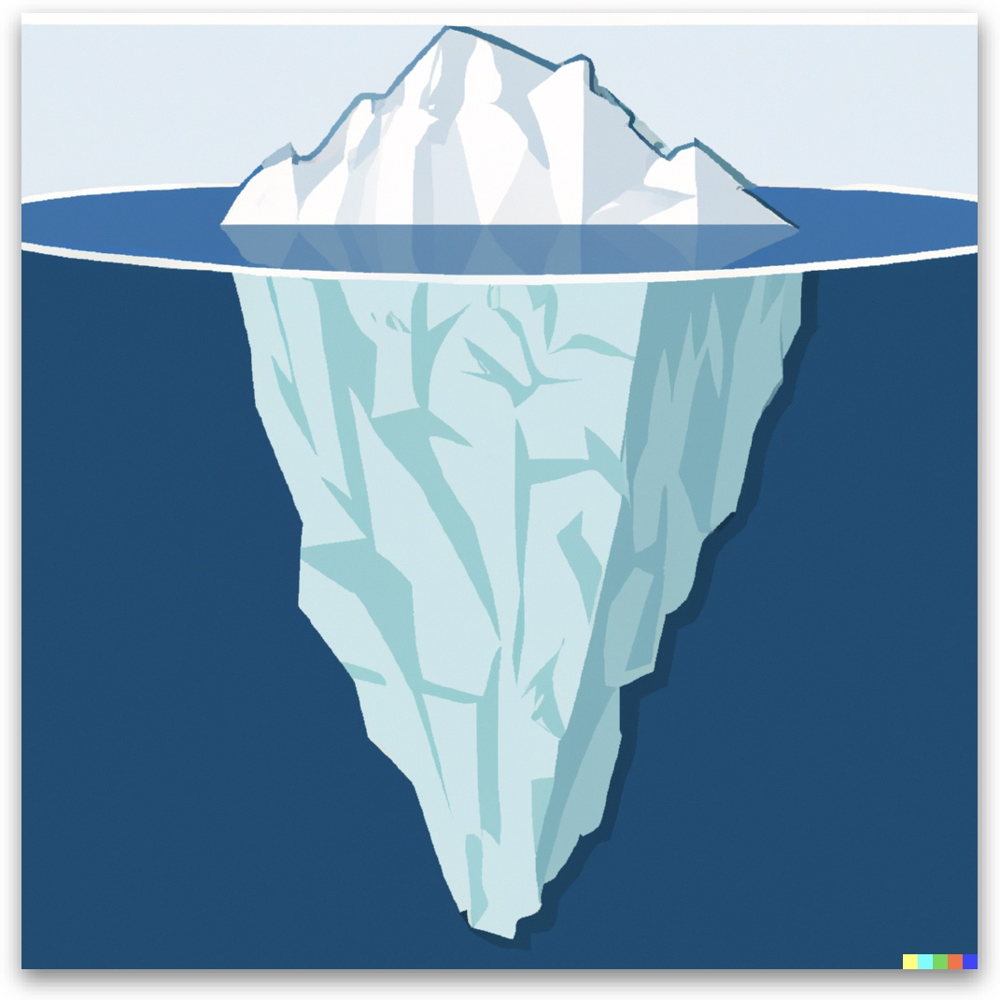

# 🔎 Les trucs des pros

## **Pour aller plus loin**

Quand on fait de la recherche en journalisme, on peut bien entendu se servir de Google, de DuckDuckGo, de Bing, ou de tout autre moteur de recherche. Mais [même si on le fait comme un chef](http://bit.ly/googchef), d’innombrables ressources restent hors de portée, car les moteurs de recherche n’indexent pas tout. D'innombrables informations restent cachées, un peu comme ce qui se trouve enfoui sous le « W » ci-dessus.

C'est ce qu'on appelle le **web invisible**, à ne pas confondre avec le _dark web_ ou le _deep web_.

Pour faire des recherches plus poussées, qu’il s’agisse de trouver des personnes ou des sources documentaires pertinentes, il faut passer directement par quelques-uns des sites inclus dans ce guide. Ce sont les outils les plus souvent utilisés par les journalistes du Québec.

<figure><figcaption>
Image générée par DALL•E 2 avec la commande : « Le web invisible est comme la partie immergée de l’iceberg », 
</figcaption></figure>

***

Cette page est une ressource en ligne destinée d’abord et avant tout aux personnes étudiantes du programme de journalisme de l’UQAM inscrites au cours EDM1400 — Méthodologie de la recherche en journalisme.

_Les différents sites indiqués sur cette page ont été colligés à partir de la fin des années 1990 en travaillant comme journaliste sur une multitude de dossiers. La liste de ces ressources a également été enrichie à l’occasion de ma participation comme co-formateur aux séances de formation sur la recherche avancée sur le web conçues par **Benoît Michaud** et **Frédéric Zalac**, à Radio-Canada, au milieu de la décennie 2000._

***

<figure><figcaption></figcaption></figure>

L'auteur de ce plan de cours (Jean-Hugues Roy) le met à la disposition de toute personne en vertu de la licence Creative Commons suivante: [Attribution - Pas d’Utilisation Commerciale 4.0 International (CC BY-NC 4.0)](https://creativecommons.org/licenses/by-nc/4.0/deed.fr).
