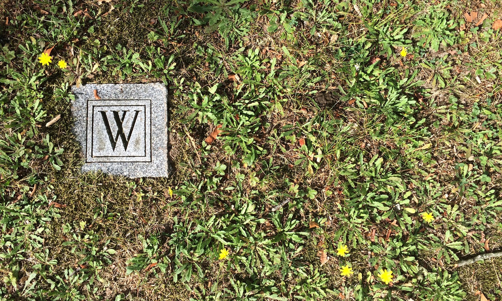

# 🔎 Les trucs des pros

<figure><figcaption>
↖️ <em>Menu en haut à gauche</em>
</figcaption></figure>

## **Pour aller plus loin**

Quand on fait de la recherche ou de la vérification, en journalisme, on peut bien entendu se servir de [Google](https://www.google.ca/), de [DuckDuckGo](https://duckduckgo.com), de [Bing](https://www.bing.com), ou de tout autre moteur de recherche. Mais [même si on le fait comme un chef](http://bit.ly/googchef), d’innombrables ressources restent hors de portée, car les moteurs de recherche n’indexent pas tout.

Ces ressources échappent également aux robots qui écument le ouaibe pour en extraire du contenu servant à entraîner de grands modèles de langue.

<figure><figcaption>
Pierre tombale avec la lettre W, cimetière de Orleans, Massachusetts (J H Roy).
</figcaption></figure>

D'innombrables informations restent ainsi cachées, un peu comme ce qui se trouve enfoui sous la petite pierre avec la lettre « W », ci-dessus.

C'est ce qu'on appelle le **web invisible**, à ne pas confondre avec le _dark web_, cet espace clandestin déployé notamment sur le réseau Tor (_The Onion Router_).

<figure><figcaption>
Image générée par DALL•E 2 avec la commande : « Le web invisible est comme la partie immergée de l’iceberg »,
</figcaption></figure>

Pour faire des recherches plus poussées, qu’il s’agisse de trouver des personnes ou des sources documentaires pertinentes, il faut passer directement par quelques-uns des sites inclus dans ce guide. Ce sont les outils les plus souvent utilisés par les journalistes du Québec.

***

Cette page est une ressource en ligne destinée d’abord et avant tout aux personnes étudiantes du [programme de journalisme de l’UQAM](https://journalisme.uqam.ca/) inscrites au cours [EDM1400 — Méthodologie de la recherche en journalisme](https://etudier.uqam.ca/cours?sigle=EDM1400). Mais vous pouvez y revenir aussi souvent que nécessaire!

La philosphie qui sous-tend ce site est bien encapsulée par cet ouvrage que je vous enjoins de lire :

<figure><figcaption>
<a href="https://hacksandleaks.com/">Hacks, Leaks, and Revelations</a>
</figcaption></figure>

_Les différents sites indiqués sur cette page ont été colligés à partir de la fin des années 1990 en travaillant comme journaliste sur une multitude de dossiers. La liste de ces ressources a également été enrichie à l’occasion de ma participation comme co-formateur aux séances de formation sur la recherche avancée sur le web conçues par **Benoît Michaud** et **Frédéric Zalac**, à Radio-Canada, au milieu de la décennie 2000._

***

<figure><figcaption></figcaption></figure>

L'auteur de ce plan de cours ([Jean-Hugues Roy](mailto:roy.jean-hugues@uqam.ca)) le met à la disposition de toute personne en vertu de la licence Creative Commons suivante: [Attribution - Pas d’Utilisation Commerciale 4.0 International (CC BY-NC 4.0)](https://creativecommons.org/licenses/by-nc/4.0/deed.fr).

***

Pour voir quand ce guide a été mis à jour la dernière fois, consultez le répertoire github sur lequel il se base: [**https://github.com/Journalisme-UQAM/Les-trucs-des-pros**](https://github.com/Journalisme-UQAM/Les-trucs-des-pros)

***

_L'image de couverture a été générée par Midjourney avec la commande suivante (en anglais): «Saumon sortant de l'eau vive pour manger des documents, dans le style de Paul Klee»._

***

Partagez ce guide avec l'URL suivant:

> [https://bit.ly/webinvisible](https://bit.ly/webinvisible)
