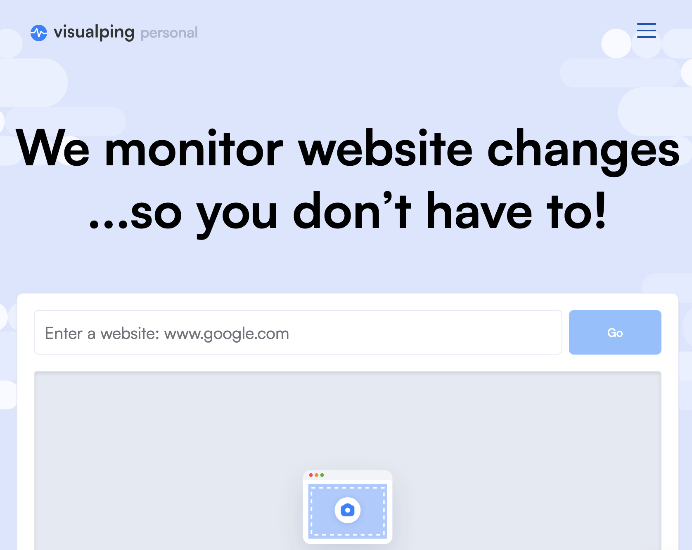

# ⏰ Outils de veille

## Alertes Google

Google vous permet de recevoir des [alertes si des mots-clés apparaissent sur des **sites web**, des **blogues** ou dans la section **Google Actualités**](https://www.google.ca/alerts). Si vous suiviez un dossier, un _beat_, il peut être très utile, aussi, de se créer des [alertes spécifiques à la section **Google Scholar**](https://scholar.google.ca/scholar\_alerts?view\_op=list\_alerts\&hl=fr) qui indexe la littérature scientifique et vous tiendra informé des dernières études dans le domaine auquel vous vous intéressez.

## Modifications dans une page web

<figure><figcaption></figcaption></figure>

Si vous devez consulter régulièrement une page web donnée pour voir s’il y a eu des changements, vous pourriez vous faciliter la vie en demandant à un robot de faire ces vérifications à votre place. Le service [**Follow that Page**](https://www.followthatpage.com/) est gratuit. Il vérifie chaque jour (vous pouvez demander aussi à ce que la vérification soit effectuée plus souvent, moyennant des frais) et vous envoie un courriel dès qu’un changement (un ajout, sinon une information retranchée ou modifiée) est remarqué.

Le service VisualPing fait la même chose, mais surveille même les changements dans l'aspect visuel des pages web! [https://visualping.io/](https://visualping.io/)

<figure><figcaption></figcaption></figure>

## RSS

La veille classique se fait par le biais des fils RSS. Différents outils, comme [**Feedly**](https://feedly.com), permettent d’en faire l’agrégation au sein d’un service web aussi accessible en app mobile. Mais les options les plus intéressantes de Feedly sont payantes.

<figure><figcaption>
Interface de Feedly
</figcaption></figure>
