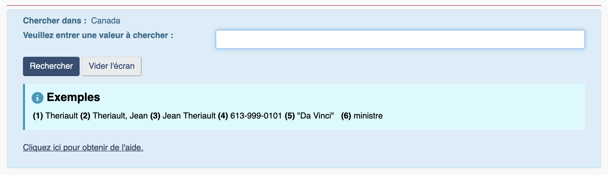

# Annuaires

## Fonction publique fédérale

<figure><figcaption>
Interface du SAGE
</figcaption></figure>

Pour retrouver des fonctionnaires fédéraux, vous pouvez consulter le site du [**Services d’annuaires gouvernementaux électroniques (SAGE)**](http://sage-geds.tpsgc-pwgsc.gc.ca/fr/SAGE?pgid=002).

Dans les résultats de recherche, j’attire particulièrement votre attention sur la liste d’hyperliens qui se trouve en bas de page. Il s’agit d’une arborescence inversée des ensembles dont fait partie le ou la fonctionnaire que vous avez trouvé(e).

<figure><figcaption>
La place du député Gérard Deltell dans l'univers de la fonction publique fédérale.
</figcaption></figure>

## Fonction publique québécoise

<figure><figcaption>
Interface du REPTEL
</figcaption></figure>

Au provincial, on trouve rapidement les numéros de poste des fonctionnaires grâce au [**Répertoire téléphonique (Reptel) du personnel de la fonction publique**](http://www.reptel.gouv.qc.ca/reptel.aspx). Il ne permet cependant pas, comme le SAGE, de situer le ou la fonctionnaire dans son univers.

