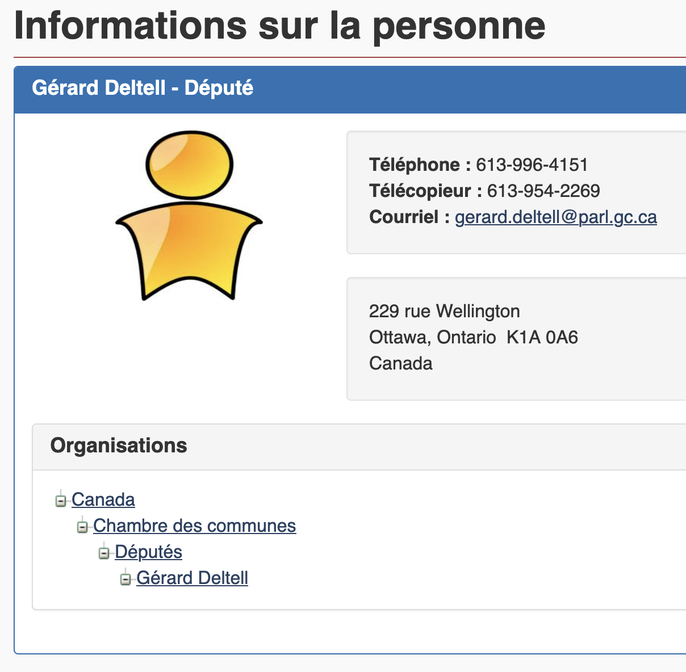
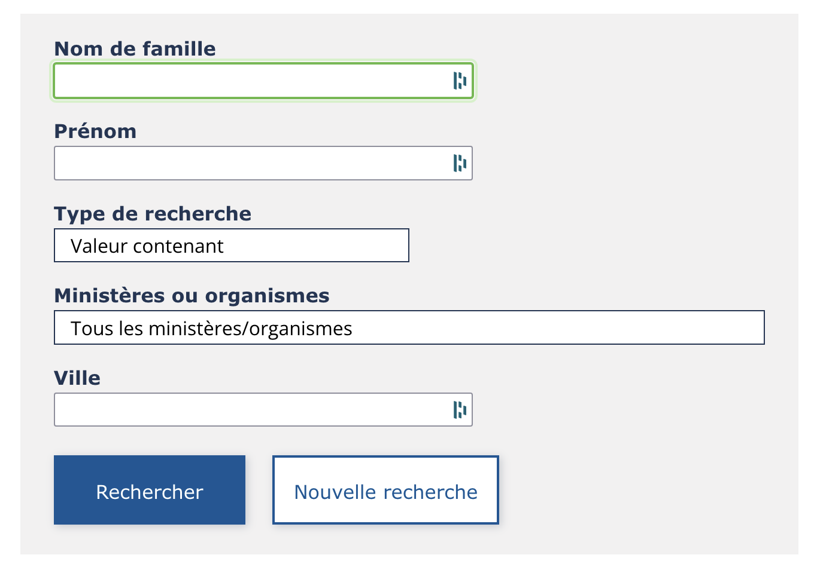

# Annuaires

## Fonction publique fédérale

<figure><figcaption><p>Interface du SAGE</p></figcaption></figure>

Pour retrouver des fonctionnaires fédéraux, vous pouvez consulter le site du [**Services d’annuaires gouvernementaux électroniques (SAGE)**](http://sage-geds.tpsgc-pwgsc.gc.ca/fr/SAGE?pgid=002).

Dans les résultats de recherche, j’attire particulièrement votre attention sur la liste d’hyperliens qui se trouve en bas de page. Il s’agit d’une arborescence inversée des ensembles dont fait partie le ou la fonctionnaire que vous avez trouvé(e).

<figure><figcaption><p>La place du député Gérard Deltell dans l'univers de la fonction publique fédérale.</p></figcaption></figure>

## Fonction publique québécoise

<figure><figcaption><p>Interface du REPTEL</p></figcaption></figure>

Au provincial, on trouve rapidement les numéros de poste des fonctionnaires grâce au [**Répertoire téléphonique (Reptel) du personnel de la fonction publique**](http://www.reptel.gouv.qc.ca/reptel.aspx). Il ne permet cependant pas, comme le SAGE, de situer le ou la fonctionnaire dans son univers.

## Annuaires téléphoniques

Il n’existe pas de répertoire gratuit de numéros de téléphone cellulaire. Pareil outil serait pratique, car de moins en moins de gens possèdent une ligne téléphonique terrestre. [**Canada411**](https://www.fr.canada411.ca/search/address.html) demeure néanmoins utile. Jusqu’en 2014, même l’ex-maire de Laval, Gilles Vaillancourt, y était encore inscrit!

Faites-y des recherches par adresse pour trouver le numéro de téléphone qui y est associé, ou encore par code postal, pour rejoindre des voisins.

<figure><figcaption><p>Interface de Canada411</p></figcaption></figure>

## Truc Google pour trouver des numéros de cellulaire

Pour trouver le numéro de quelqu'un avec une recherche Google, combinez le nom de la personne avec les indicatifs régionaux de la région où elle habite.

### Île de Montréal

```
"Prénom Nom" 514 OR 438 OR 263
```

### Grand Montréal

```
"Prénom Nom" 450 OR 579 OR 354
```

### Capitale-Nationale et Est du Québec

```
"Prénom Nom" 418 OR 581 OR 367
```

### Estrie, Mauricie, Outaouais, Abitibi-Témiscamingue et Nord du Québec

```
"Prénom Nom" 819 OR 873 OR 468
```
