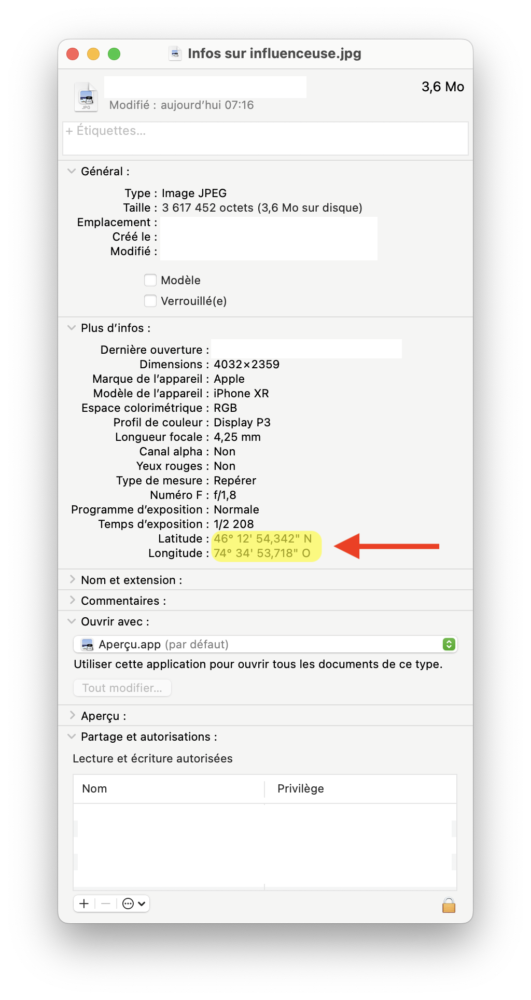
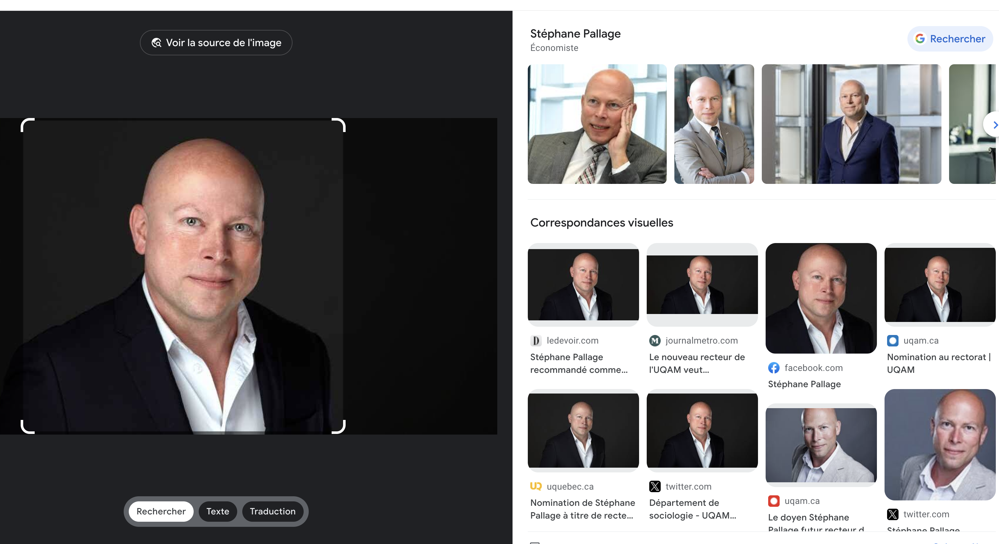
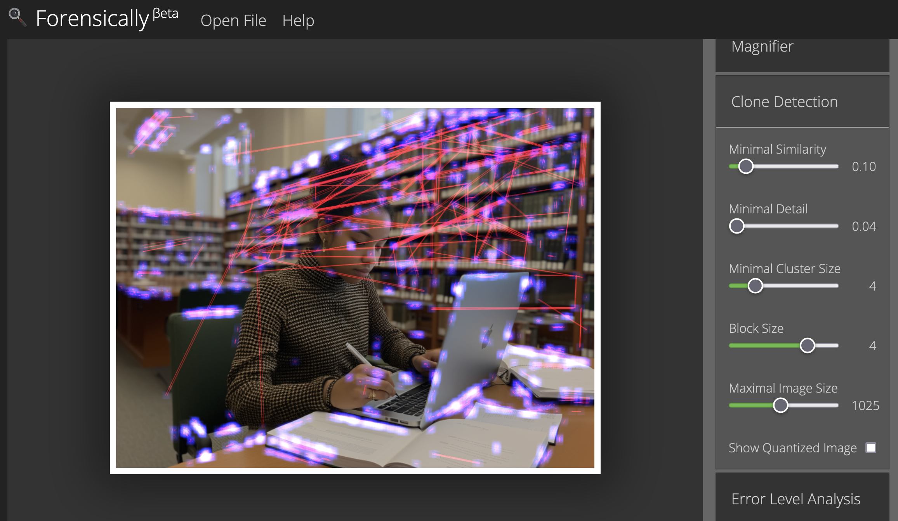
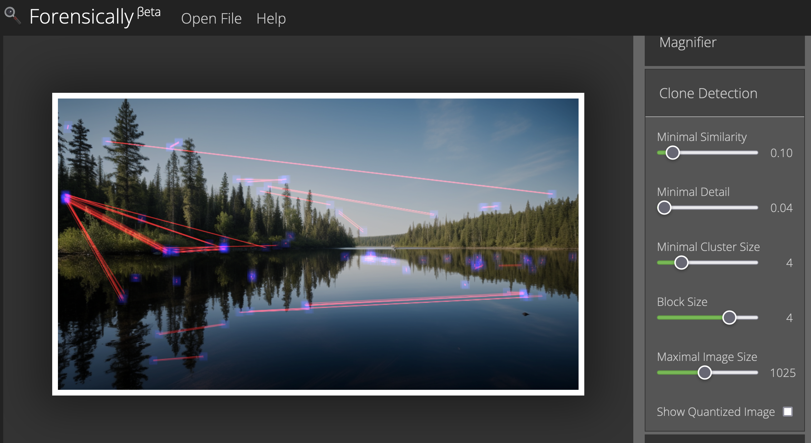
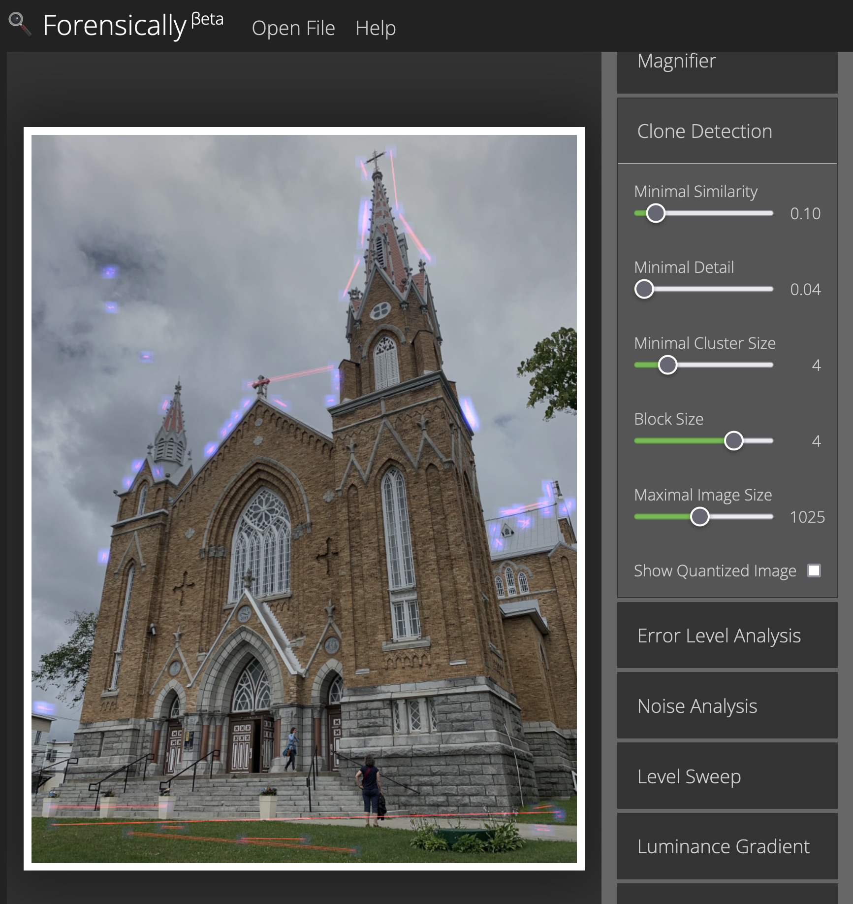
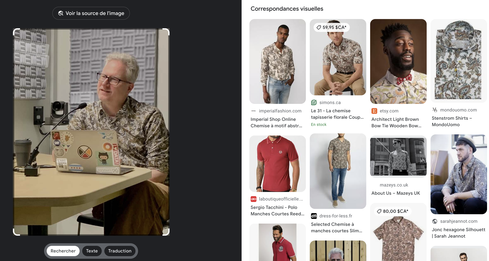

# 📸 Analyse d'images

## Métadonnées

Ce devrait être votre premier réflexe.

Pensez d'abord à consulter les métadonnées d'une image. Parfois, vous y trouverez la réponse à: _**«Où diable cette photo a-t-elle été prise?»**_

<figure><figcaption></figcaption></figure>

Quand les métadonnées sont muettes, vous pouvez vous tourner vers l'un ou l'autre des outils suivants.

## Recherche d'images inversée

Quatre outils de recherche d'images inversée peuvent être utiles.

* [**TinEye**](https://tineye.com), le plus ancien, ne va que vous permettre de retrouver exactement l'image que vous lui soumettez.
* [**Google Lens**](https://www.google.ca/imghp?hl=fr) est souvent très bon, mais il est davantage conçu comme un outil pour nous aider à magasiner, donc il va parfois focaliser sur les vêtements que la personne porte ou les objets autour plutôt que de nous dire qui apparaît sur la photo ou où est-ce qu'on se trouve (voir exemple en bas de page).
* [**Bing images**](https://www.bing.com/visualsearch) peut parfois s'avérer une bonne solution de rechange à Google.
* Le volet images du moteur de recherche russe [**Yandex**](https://yandex.com/images/) peut également être utilisé si les deux précédents ne donnent pas les résultats escomptés.

### Qui est sur la photo?

J'ai soumis une photo intitulée _dude.jpg_. C'est Google Lens qui a le mieux reconnu le recteur de l'UQAM.

<figure><figcaption>
Google Pallage a reconnu M. Image
</figcaption></figure>

### Qu'est-ce que c'est?

J'ai soumis une image appelée _egliz.jpg_ et Google Lens a été l'outil qui a réussi à identifier précisément de quelle bâtiment il s'agissait.

<figure><figcaption>
Église Sainte-Agnès, située au centre-ville de Lac-Mégantic.
</figcaption></figure>

J'ai par contre soumis une autre image appelée _metro.jpg_. Tous les outils ont eu de la difficulté. Même Google Lens a incorrectement identifié l'immeuble se trouvant derrière l'affiche du métro. Le moteur de recherche croit qu'il s'agit d'un building de l'Iowa qui n'a même pas été conçu par le même architecte... Dans les autres résultats, cependant, on trouve la bonne réponse.

<figure><figcaption>
Un des immeubles du complexe Westmount Square, construit en 1967 et conçu par le célèbre architecte Mies Van der Rohe.
</figcaption></figure>

### Où suis-je?

Mise en situation. Vous faites enquête sur une influenceuse en cavale. Vous trouvez cette photo sur Instagram. Où a-t-elle été prise? Ici encore, Google Lens est celui qui réussit le mieux à reconnaître le paysage en arrière-plan.

<figure><figcaption>
Notre influenceuse est à Tremblant avec une groupie.
</figcaption></figure>

## Analyse criminalistique (_forensic_)

Pour savoir si on a affaire à une image manipulée (par modification avec Photoshop, par exemple) ou générée par un système basé sur l'IA, on peut en effectuer l'analyse à l'aide de [**Forensically**](https://29a.ch/photo-forensics/).

Son outil «_**Clone detection**_» permet de repérer les zones où il y a eu du copier-coller.

Les images générées par IA ont tendance à avoir plus de ces zones que les images réelles. Voici deux exemples avec des images générées par Midjourney dont le réalisme est à s'y méprendre.

<figure><figcaption></figcaption></figure>

<figure><figcaption></figcaption></figure>

Comparez toujours avec des images dont l'authenticité ne fait pas de doute et examinez-les avec les mêmes paramètres.

<figure><figcaption></figcaption></figure>

<figure><figcaption></figcaption></figure>

## Quand Google se goure

Google Lens pense souvent qu'on cherche un produit plutôt qu'une personne. Exemple local.

<figure><figcaption>
Je ne suis qu'une chemise
</figcaption></figure>
