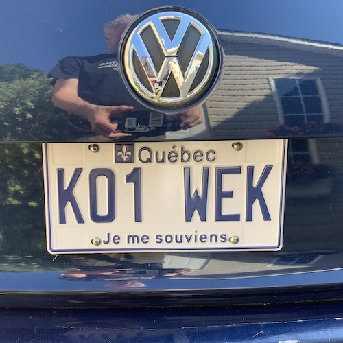
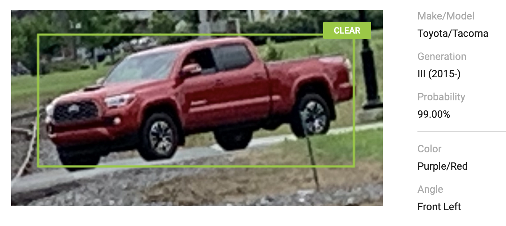

# 🕵♀ Autres outils

<figure><figcaption>
Non, il n'existe pas de base de données des numéros de plaques minéralogiques au Canada. Aux États-Unis, cependant, c'est possible d'obtenir des infos avec un numéro de plaque et l'État qui l'a émise.
</figcaption></figure>

## IntelTechniques 

Michael Bazell, auteur d'[**IntelTechniques**](https://inteltechniques.com/tools/index.html), regroupe dans une seule page toute une variété d'outils dont l'un permet d'obtenir des infos avec un numéro de plaque américain. Parmi les outils qu'il réunit:

* Réseaux sociaux et communautés (incluant **Reddit** ou **Discord**)
* Chercher dans le _dark web_ (via réseau Tor)
* Recherches par nom, par pseudo ou par adresse courriel dans une multitude d'outils
* etc. (toujours ma catégorie préférée)

### Recherches dans le nuage

Une des recommandations de M. Bazell est de penser aux nombreux services infonuagiques qui hébergent des documents au cas où une organisation qui vous intéresse a partagé par mégarde un document donné. Vous pouvez y farire des recherches Google avec l'opérateur `site:`.

Voici quelques exemples :&#x20;

* **Google Docs** -> `site:docs.google.com "expression recherchée"`
* **Google Docs** (autre nom de domaine) -> `site:drive.google.com "expression recherchée"`
* **Amazon Web Services (AWS)** plusieurs organisations y enregistrent des documents -> `site:amazonaws.com "expression recherchée"`
* **Google Cloud** -> `site:cloud.google.com "expression recherchée"`
* **Microsoft 365** -> `site:docs.microsoft.com "expression recherchée"`

### Carnet 

Carnet.ai fait pour les voitures ce que Shazam fait pour la musique.

<figure><figcaption></figcaption></figure>

[https://carnet.ai/](https://carnet.ai/)

## Les outils de Bellingcat 

<figure><figcaption>
Logo de <em>Bellingcat</em>
</figcaption></figure>

_Bellingcat_ est peut-être le média qui a le mieux popularisé l’OSINT avec plusieurs enquêtes retentissantes. Ses artisan•es ont regroupé dans un même répertoire [quelques-unes de leurs ressources](https://www.bellingcat.com/category/resources/), incluant des guides pratiques et la méthodologie détaillée de leurs principales enquêtes.
