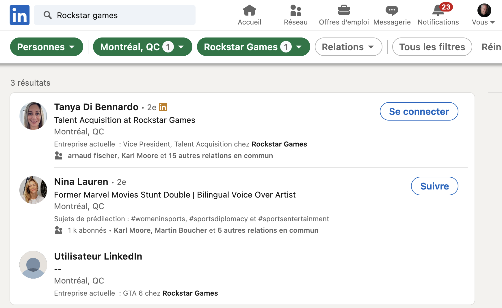
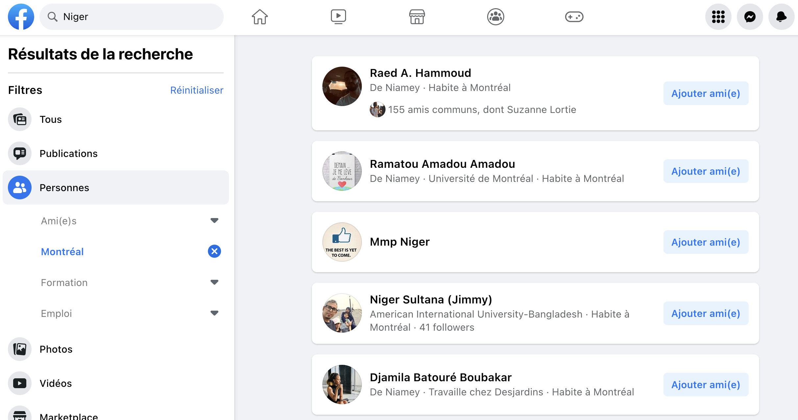

# 📱 Réseaux sociaux

## LinkedIn

**LinkedIn** est un réseau social professionnel auquel il peut valoir la peine de s’abonner. Il peut arriver que des gens qu’on recherche y laissent des informations intéressantes sur leur parcours professionnel.

Il faut choisir de chercher parmi les **Personnes**. On peut ensuite faire une recherche parmi les employé.e.s d’une même entreprise. On peut aussi filtrer cette recherche par lieu. Ainsi, l’image ci-dessous nous montre ce que LinkedIn contient quand on lui demande des employés de Rockstar Games à Montréal.

<figure><figcaption><p>J'ignore si vous obtiendrez les mêmes résultats, cependant. Les deux premiers résultats font partie des personnes qui sont dans les réseaux de personnes avec qui je suis connecté dans LinkedIn.</p></figcaption></figure>

## X (_fka_ Twitter)

Twitter offre une interface de [**recherche avancée**](https://twitter.com/search-advanced?lang=fr) qui permet de retrouver du contenu en fonction de **mots-clés** (avec des opérateurs qui ressemblent à ceux de Google), de **mots-clics** (_hashtags_) ou de **comptes** (@). Il est même possible de filtrer le tout par date.

<figure><figcaption></figcaption></figure>

## Facebook

Les résultats de la [**recherche avancée**](https://www.facebook.com/) de Facebook ont perdu en qualité depuis 2020. Il demeure malgré tout possible de l'utiliser pour trouver des personnes à Montréal spécialisées sur un sujet donné ou touchées par un événément dans l'actualité. Coup d'État au Niger? Cette recherche permet de trouver des abonnés Facebook vivant à Montréal mais d'origine nigérienne.

<figure><figcaption></figcaption></figure>

## TikTok

Vous pouvez faire des recherches dans TikTok en utilisant simplement le bon vieux truc du `site:`:&#x20;

```
site:tiktok.com "expression recherchée"
```

## Autres réseaux sociaux

Enfin, selon la recherche que vous devez faire, il pourrait être utile de considérer certains réseaux sociaux plus obscurs et prisés par l’extrême-droite ou les adeptes des théories du complot, comme [**VKontakte**](https://vk.com/) (ou VK, dont l’interface ressemble à s’y méprendre à Facebook), [**Gab**](https://gab.com/) ou [**Parler**](http://parler.com)**.**

<figure><figcaption></figcaption></figure>
