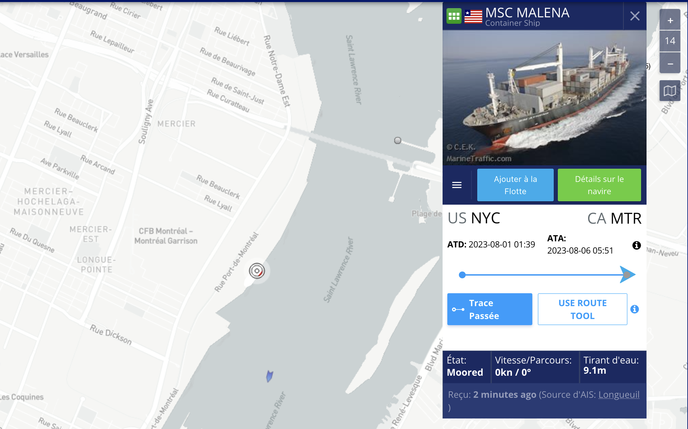

# ✈ Avions et bateaux

## Aéronefs 

<figure><figcaption></figcaption></figure>

* Le [**Registre des aéronefs**](https://wwwapps.tc.gc.ca/Saf-Sec-Sur/2/CCARCS-RIACC/RchSimp.aspx?lang=fra) de Transport Canada, si jamais vous cherchez des informations sur un avion, un hélico, une montgolfière ou ses propriétaires.
* Un [registre semblable existe aussi aux États-Unis](https://registry.faa.gov/aircraftinquiry/Search/NNumberInquiry) dans les cas où, comme avec l’écrasement qui a causé la mort du chroniqueur Jean Lapierre et de six autres personnes aux Îles-de-la-Madeleine, en mars 2016 (photo ci-dessus), l’appareil est immatriculé chez nos voisins du sud.
* S’il s’agit d’un avion enregistré à l’extérieur du Canada, [**ADS-B Exchange**](https://globe.adsbexchange.com/) peut vous donner, peut-être plus rapidement, des informations sur cet appareil.
* Le code OACI d’un appareil fait partie des informations à recueillir dans le Registre fédéral des aéronefs ou sur ADB-S. C'est un code **hex**adécimal se trouvant tout à droite de la ligne « Adresse 24-bit » que vous trouverez dans le Registre fédéral. Avec ce code, vous pouvez consulter l’historique récent des vols qu’il a effectués grâce à [**Opensky**](https://opensky-network.org/aircraft-database).

## Navires

On peut faire quelque chose d'équivalent avec le site Marine Traffic pour avoir plus d'informations sur un navire qui est à quai au port de Montréal, par exemple. [https://www.marinetraffic.com](https://www.marinetraffic.com)

<figure><figcaption>
En cliquant sur «Détails sur le navire», on apprend que ce porte-conteneurs battant pavillon libérien 🇱🇷 a été construit en 2000.
</figcaption></figure>
