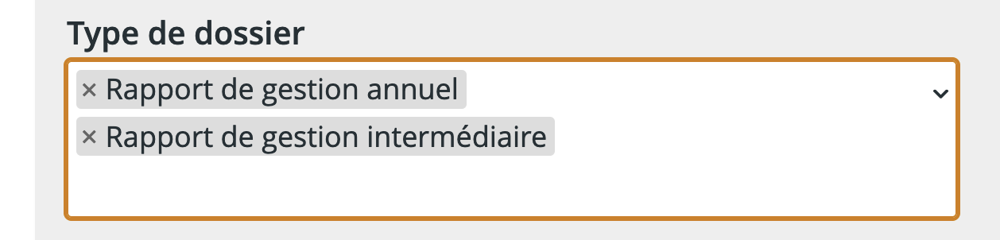
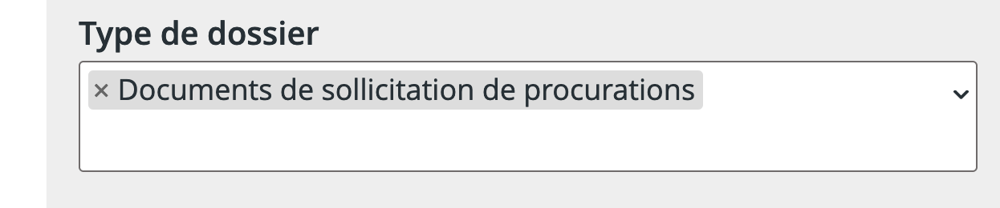

# 💰 Outils économiques

## Sociétés cotées à la bourse

Si le journalisme économique vous intéresse, vous trouverez rapidement tous les documents rendus publics par les sociétés canadiennes cotées en bourse grâce au [**Système électronique de données, d’analyse et de recherche (SEDAR)**](https://www.sedarplus.ca/landingpage/fr/) offert par l’Association canadienne des valeurs mobilières.

<figure><figcaption>
SEDAR a été rénové en 2023 après des décennies d'interface résolument XXe siècle.
</figcaption></figure>

Deux types de documents peuvent contenir des informations d’intérêt public:

* La rémunération des dirigeant•es (ce qu’on appelle en anglais _executive compensation_) se trouve généralement dans un document intitulé **« Circulaire de sollicitation de procurations par la direction »**.
* Les informations financières intéressantes, par ailleurs, se retrouvent généralement dans un document appelé **« Rapport de gestion »** (_Management’s Discussion and Analysis_ ou _MD\&A_ en anglais).

Pour les trouver, faites une recherche avec le nom d'une entreprise qui vous intéresse, puis, dans la section « Type de dossier », entrez des termes associés au type de document qui vous intéresse.

<figure><figcaption></figcaption></figure>

 

<figure><figcaption></figcaption></figure>

L’équivalent américain s’appelle [**EDGAR**](http://www.sec.gov/edgar/searchedgar/companysearch.html). Il est offert par la _Securities and Exchange Commission (SEC)_ des États-Unis.

## Registres de l'AMF

<figure><figcaption></figcaption></figure>

L'[**Autorité des marchés financiers (AMF)**](https://lautorite.qc.ca) gère [plusieurs registres](https://lautorite.qc.ca/grand-public/registres) qui peuvent vous être utiles dans le cadre d'un reportage, dont:

* [Registre des entreprises et des individus autorisés à exercer](https://lautorite.qc.ca/grand-public/registres/registre-des-entreprises-et-des-individus-autorises-a-exercer) pour vérifier si une personne est autorisée à vendre des produits financiers ou à donner des conseils sur ces produits
* [Registre de plateformes de cryptoactifs](https://lautorite.qc.ca/grand-public/registres/plateformes-de-negociation-de-cryptoactifs)

