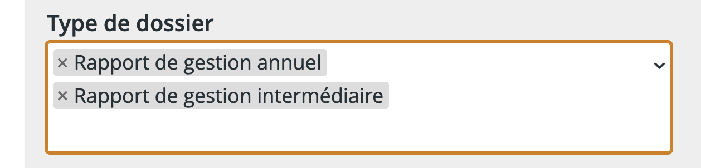
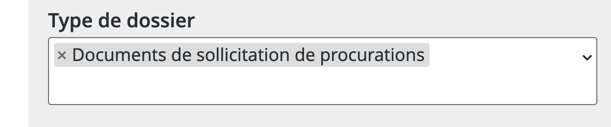

# 💰 Outils économiques

## Sociétés cotées à la bourse

Si le journalisme économique vous intéresse, vous trouverez rapidement tous les documents rendus publics par les sociétés canadiennes cotées en bourse grâce au [**Système électronique de données, d’analyse et de recherche (SEDAR)**](https://www.sedarplus.ca/landingpage/fr/) offert par l’Association canadienne des valeurs mobilières.

<figure><figcaption>
SEDAR a été rénové en 2023 après des décennies d'interface résolument XXe siècle.
</figcaption></figure>

Deux types de documents peuvent contenir des informations d’intérêt public:

* La rémunération des dirigeant•es (ce qu’on appelle en anglais _executive compensation_) se trouve généralement dans un document intitulé **« Circulaire de sollicitation de procurations par la direction »**.
* Les informations financières intéressantes, par ailleurs, se retrouvent généralement dans un document appelé **« Rapport de gestion »** (_Management’s Discussion and Analysis_ ou _MD\&A_ en anglais).

Pour les trouver, faites une recherche avec le nom d'une entreprise qui vous intéresse, puis, dans la section « Type de dossier », entrez des termes associés au type de document qui vous intéresse.

<figure><figcaption></figcaption></figure> <figure><figcaption></figcaption></figure>

L’équivalent américain s’appelle [**EDGAR**](http://www.sec.gov/edgar/searchedgar/companysearch.html). Il est offert par la _Securities and Exchange Commission (SEC)_ des États-Unis.

## Registres de l'AMF

<figure><figcaption></figcaption></figure>

L'[**Autorité des marchés financiers (AMF)**](https://lautorite.qc.ca) gère [plusieurs registres](https://lautorite.qc.ca/grand-public/registres) qui peuvent vous être utiles dans le cadre d'un reportage, dont:

* [Registre des entreprises et des individus autorisés à exercer](https://lautorite.qc.ca/grand-public/registres/registre-des-entreprises-et-des-individus-autorises-a-exercer) pour vérifier si une personne est autorisée à vendre des produits financiers ou à donner des conseils sur ces produits
* [Registre de plateformes de cryptoactifs](https://lautorite.qc.ca/grand-public/registres/plateformes-de-negociation-de-cryptoactifs)

## Faillites

<figure><figcaption>
Le Cirque du Soleil s'est placé à l'abri de ses créanciers en 2020.
</figcaption></figure>

Enfin, vous pourriez être appelé à couvrir des « faillites ». Je mets le mot entre guillemets, car avant de faire vraiment faillite, une entreprise va se placer à l’abri de ses créanciers afin de tenter de trouver une solution à ses problèmes financiers.

Deux lois peuvent être utilisées: la **Loi sur la faillite et l’insolvabilité** (LFI) ou la **Loi sur les arrangements avec les créanciers des compagnies** (LACC).

Ces procédures sont publiques et renferment des renseignements très intéressants pour vos reportages.

Les dossiers d’insolvabilité **en cours** qui passent par la LACC sont regroupés par le Bureau du surintendant des faillites du Canada dans cette [**Liste des procédures sous la LACC**](https://www.ic.gc.ca/eic/site/bsf-osb.nsf/fra/h_br02281.html).

Les dossiers qui passent par la LFI (ou qui sont **fermés** et qu’il pourrait être intéressant de consulter) sont, quant à eux, regroupés dans ce [**Registre des dossiers de faillite et d’insolvabilité**](https://www.ic.gc.ca/app/scr/bsf-osb/ins/connexion.html?lang=fra) **(\$$)**… qui coûte cependant 8$ par consultation…

Quelle que soit la loi utilisée, les dossiers d’insolvabilité **en cours** sont traités par un•e syndic•que ou un•e contrôleur•e. La plupart de ces syndic•ques ou contrôleurs publient la liste des dossiers qu’ils traitent sur leur site. Voici les principaux au Québec:

* [Ernst & Young](https://documentcentre.eycan.com/default.aspx) -> [https://documentcentre.ey.com/#/home](https://documentcentre.ey.com/#/home)
* [KPMG](https://home.kpmg/ca/fr/home/services/advisory/deal-advisory/creditorlinks.html)
* [Price Waterhouse Coopers](https://www.pwc.com/ca/fr/services/insolvency-assignments.html)
* [Raymond Chabot](https://www.raymondchabot.com/dossiers-publics/)

## Conventions collectives

<figure><figcaption>
L’interface résolument 20e siècle du registre CORAIL.
</figcaption></figure>

Vous cherchez des **conventions collectives**? L’outil [**CORAIL**](https://www.corail.gouv.qc.ca), du ministère du Travail du Québec peut vous aider à les retrouver si vous devez faire un reportage sur un conflit de travail afin de vérifier les affirmations de toutes les parties. Souvent, ces documents vous permettent de connaître les salaires des employé.e.s touché.e.s par une _grève_ ou un _lock-out_ (attention, d’ailleurs, de ne pas mêler les deux).
