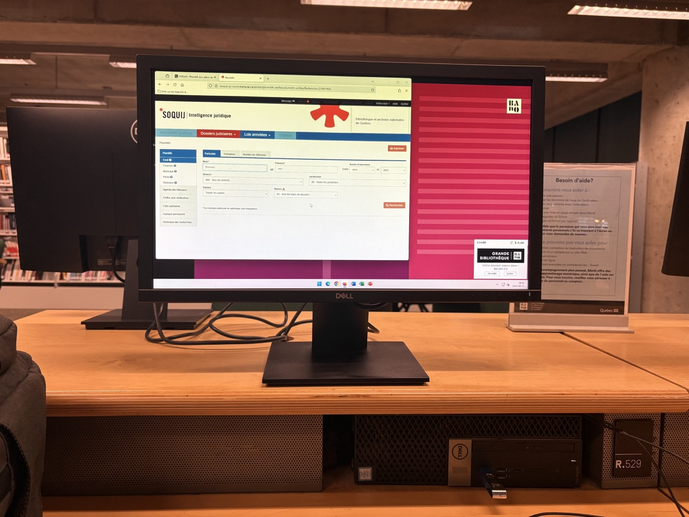

# ⚖️ Outils juridiques

## Horaire des procès (rôle)

Si vous couvrez un procès, l’outil le plus facile pour savoir quand et où il aura lieu est le [**rôle d’audiences**](http://roles.tribunaux.qc.ca/) des tribunaux du sud du Québec. Les procès sont appelés des dossiers.

Un numéro de dossier pourrait vous être utile, également, pour trouver de l’information avec l’outil suivant.

## Décisions

En effet, pour consulter les **décisions rendues** (ou **jugements)** par presque _tous_ les tribunaux au Canada, de la Cour suprême à la Cour des petites créances de la Nouvelle-Écosse, en passant par la Cour du banc de la reine de l’Alberta ou la Cour supérieure du Québec, ainsi que pour retrouver des **lois**, partout au pays, je vous conseille le site de l’[**Institut canadien d’information juridique**](https://www.canlii.org/?origLang=fr) (aussi connu sous son acronyme anglais, **CanLII**). Il contient aussi les décisions de nombreux tribunaux administratifs comme les Conseils de discipline de tous les ordres professionnels au Québec. Et depuis 2020, il est même accessible en _**dark mode**_! 😜

Le site [**jugements.qc.ca**](http://citoyens.soquij.qc.ca/) vous permet également d’accéder à des jugements, mais au Québec seulement (avec la Cour suprême du Canada).


**Attention!**

Ces bases de données ne contiennent PAS la totalité des décisions. Selon Louis-Samuel Perron, reporter judiciaire à _La Presse_, la moitié seulement des décisions rendues par les tribunaux du Québec seulement s'y retrouverait.


## Historique d'une poursuite : le PLUMITIF

Deux autres types d’information publique de nature juridique pourraient vous intéresser, comme journaliste:

* Le **dossier criminel** d’un individu.
* Le **plumitif**, c’est-à-dire l’historique d’une poursuite civile ou criminelle, et ce, même si les démarches n’aboutissent pas à un procès.

### Plumitif des tribunaux québécois (\$$$)

Dans la plupart des cas, pour accéder à ce type d’information, il faut [s'abonner à la Société québécoise d’information juridique (SOQUIJ)](https://soquij.qc.ca/a/fr/produits/plumitifs). L'abonnement coûte 15 dollars par mois. Chaque recherche dans le plumitif coûte ensuite 4 dollars et chaque dossier que vous consultez, 4 dollars supplémentaires. C'est dont très coûteux **(\$$$)**…

Vous pouvez toutefois accéder à l'interface web des plumitifs offerts par la SOQUIJ au rez-de-chaussée de la Grande bibliothèque (à Montréal) et dans d'autres bibliothèques de BAnQ au Québec.

Il faut :

* être **abonné à BAnQ** (c'est gratuit) et
* se munir d'une **clé USB** pour sauvegarder ses résultats de recherche.

<figure><figcaption>
<mark style="background-color:purple;">Cherchez les ordinateurs au fond d'écran rose</mark>.
</figcaption></figure>

### Plumitifs gratuits!

Il faut cependant savoir que certains plumitifs sont publiquement accessibles.

* Ceux de la **Cour fédérale** et de la **Cour d’appel fédérale**. Dans cet [**outil de recherche dans ses dossiers de cour**](https://www.fct-cf.gc.ca/fr/dossiers-de-la-cour-et-decisions/dossiers-de-la-cour), il s’agit de rechercher par « Renseignements sur les parties », puis de cliquer sur la loupe (🔍) sous la colonne « en savoir plus » pour faire afficher les différentes étapes de la cause qui vous intéresse.
* Ceux du **Tribunal administratif du travail** (TAT). Il faut d’abord [consulter l’horaire (rôle) d’une cause](https://services.tat.gouv.qc.ca/consultation-role) qui vous intéresse en recherchant par mot-clé. Ce premier outil vous donne ensuite un numéro de dossier que vous pouvez entrer dans ce [deuxième outil (historique d’un dossier)](https://services.tat.gouv.qc.ca/consultation-dossier/) qui vous donne ensuite toutes ses étapes.

## Retranscription d'un dossier (\$$)

Il est possible de [demander la **retranscription d'un dossier**](https://www.quebec.ca/justice-et-etat-civil/services/transcription-dossier). Cette retranscription contient « soit ce qui a été dit pendant un procès; soit un autre document qui fait partie du dossier d’un procès ». Ce n'est pas un service gratuit, par contre... (Merci à Olivier Larose-Desnoyers pour le tuyau).

## Autre registres juridiques

* [**Actions collectives**](https://www.registredesactionscollectives.quebec/fr/Consulter/RecherchePublique)
* [**Registre des condamnations**](https://www.registres.environnement.gouv.qc.ca/condamnations/recherche.asp) (ministère de l'Environnement)
* [**Droits personnels et réels mobiliers**](https://www.rdprm.gouv.qc.ca/fr/Pages/Accueil.html) (pour vérifier si certains biens ont été donnés en garantie; dans des enquêtes vraiment _deep_).
* Recherchez les [**demandes d'accès à l'information antérieures**](https://ouvert.canada.ca/fr/search/ati) auprès d'organismes fédéraux.
* [etc.](https://www.quebec.ca/justice-et-etat-civil/registres-legaux)
