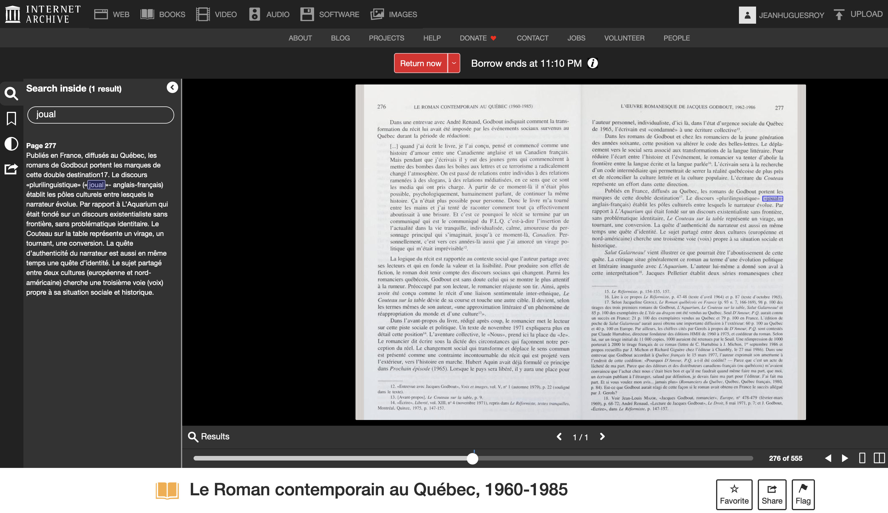

# 🦕 Reculer dans le temps

## Wayback Machine

<figure><figcaption></figcaption></figure>

La [**Wayback Machine**](http://archive.org/web/) permet de voir l’apparence qu’avait un site web à une époque donnée et, ainsi, de retrouver des informations qui ne sont peut-être plus accessibles à l’aide de la cache de Google.

## Documents numérisés

L'organisation qui héberge la Wayback Machine, [**Archive.org**](https://archive.org/), continent également une masse incroyable de documents numérisés. Leur collection de livres publiés au Québec est étonnante!

<figure><figcaption>
La sélection d'ouvrages numérisés est beaucoup plus importante que celle qu'offre Google Livres, par exemple.
</figcaption></figure>
