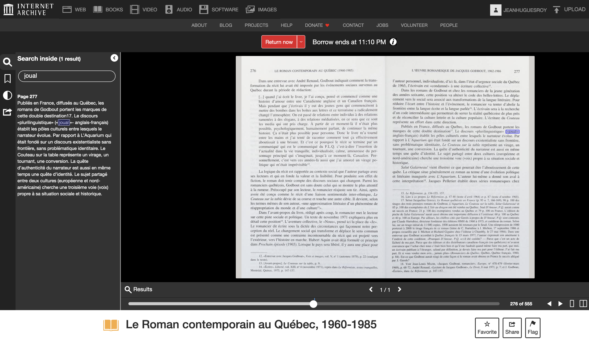

# 🦕 Reculer dans le temps

## Wayback Machine

<figure><figcaption></figcaption></figure>

La [**Wayback Machine**](https://web.archive.org/) permet de voir l’apparence qu’avait un site web à une époque donnée et, ainsi, de retrouver des informations qui ont été effacées du web. Fascinant, comme dirait Charles Tisseyre.

### Archive Today

Si vous ne trouvez rien dans la Wayback, [**Archive Today**](https://archive.ph/) est une solution de rechange qui fait cependant un archivage moins exhaustif du web.

### Common Crawl

L'écumage le plus exhaustif du web est réalisé par [**Common Crawl**](https://commoncrawl.org/). Mais le désavantage, c'est que ce site contient des quantités phénoménales de données difficiles à extraire.

## Documents numérisés

L'organisation qui héberge la Wayback Machine, [**Archive.org**](https://archive.org/), continent également une masse incroyable de documents numérisés. Leur collection de livres publiés au Québec, par exemple, est étonnante!

<figure><figcaption>
La sélection d'ouvrages numérisés est beaucoup plus importante que celle qu'offre Google Livres, par exemple.
</figcaption></figure>
