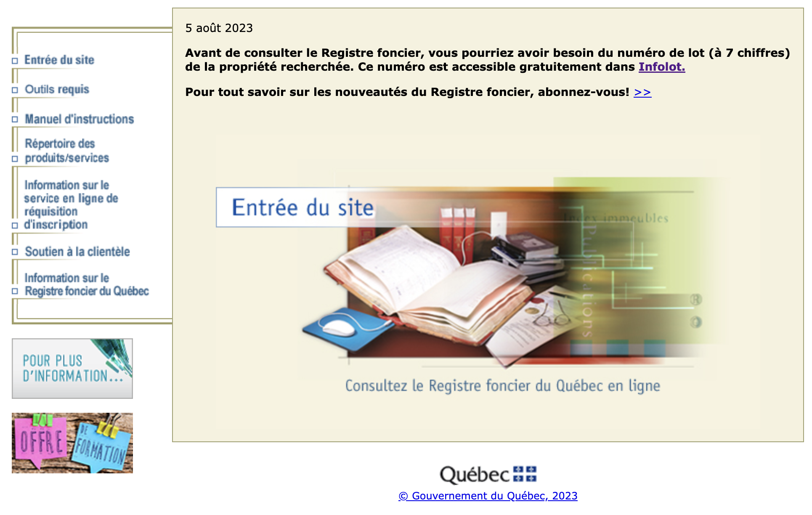
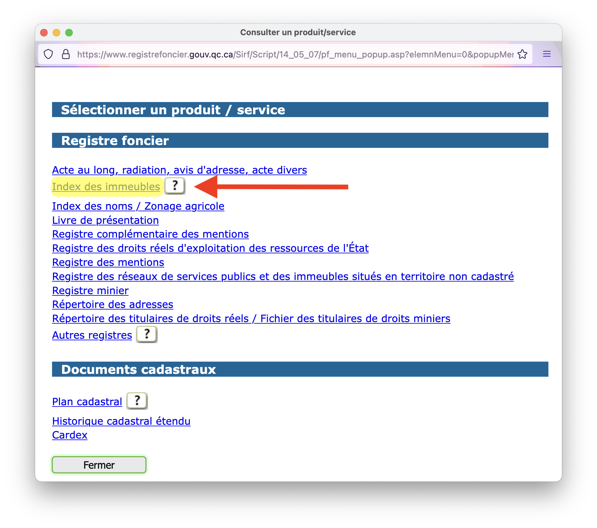

# 🏡 Registre foncier et infolot

Ensuite, grâce au **numéro de lot** qui se trouve sur la fiche d’évaluation de la propriété, vous pouvez faire deux choses.

## Infolot

Vous pouvez d’abord localiser le lot sur [**Infolot**](https://appli.mern.gouv.qc.ca/infolot/), une carte interactive du cadastre du Québec offerte par le ministère des Ressources naturelles.

<figure><figcaption>
Être propriétaire, au fond, c’est posséder son petit polygone de planète Terre
</figcaption></figure>

## Registre foncier

Vous pouvez ensuite approfondir votre recherche d’informations grâce au [**Registre foncier**](http://www.registrefoncier.gouv.qc.ca/Sirf/) **($)**. Ici, les services ne sont plus gratuits. Ils sont cependant peu coûteux (1$ par opération) et il peut valoir la peine, comme journaliste, de s’inscrire au registre (c’est gratuit) afin d’avoir un numéro de code qui accélère sa consultation.

Ce site a, lui aussi, une apparence résolument _old school_. Vous commencez en cliquant sur cette image à partir de la page d’accueil :

<figure><figcaption>
La date indique 2023, mais on se croirait un quart de siècle plus tôt!
</figcaption></figure>

Dans la page qui s’ouvre ensuite, vous pouvez entrer les informations relatives à votre carte de crédit, ou votre code d’accès et votre mot de passe.&#x20;

<figure><figcaption></figcaption></figure>

Dans l’autre page qui s’ouvre ensuite, vous pouvez cliquer sur le bouton « **Consulter** » dans le menu se trouvant en haut.

<figure><figcaption></figcaption></figure>

Enfin, dans la fenêtre qui s’ouvrira, parmi tous les services qu’on vous proposera, c’est sur l’**« index des immeubles** » qu’il sera le plus intéressant de cliquer.

<figure><figcaption></figcaption></figure>

Puis, vous entrez le numéro de lot dans le champ correspondant, en prenant soin de choisir « **Cadastre du Québec** » et vous pourrez consulter la liste des dernières transactions relatives à ce lot et même consulter des documents comme les plus récents actes de ventes ou actes hypothécaires, ce qui peut s’avérer utile dans une enquête.
