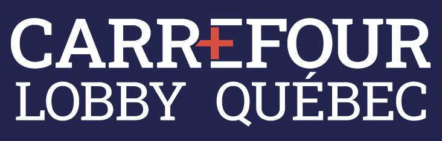

# 🧀 SEAO et lobbyistes

<figure><figcaption></figcaption></figure>

## SEAO

Jetez de temps à autre un œil sur le [**Système électronique d’appel d’offres (SÉAO)**](https://seao.ca/). On y fait parfois des trouvailles intéressantes sur les travaux ou les études que veulent entreprendre divers pouvoirs publics (ministères, municipalités, institutions, etc.) S’abonner à ce site (c’est gratuit) vous permet de personnaliser l’apparence de la page d’accueil.

Au fédéral, l’outil de recherche des appels d’offres sur les marchés publics s’appelle [**MERX**.](http://www.merx.com/) Il couvre non seulement les agences du gouvernement fédéral, mais aussi les appels d’offres lancés par différentes provinces canadiennes. Utile si vous êtes appelé.e à travailler à l’extérieur du Québec.

## Registres des lobbyistes

<figure><figcaption></figcaption></figure>

Une autre très bonne façon de trouver de la nouvelle dans votre région ou votre secteur d’activité, c’est de consulter régulièrement [**Carrefour Lobby Québec**](https://www.carrefourlobby.quebec/home), le nouveau nom du **Registre des lobbyistes**. En faisant une recherche par municipalité ou par ministère, par exemple, vous êtes en mesure de voir pour quels projets, au juste, des entrepreneurs ou des organismes font des démarches auprès de ces organismes publics.

Le [**Registre fédéral des lobbyistes**](https://lobbycanada.gc.ca/app/secure/ocl/lrs/do/guest?lang=fra) est intéressant pour les mêmes raisons.

Pour comprendre comment fonctionne le lobbying au Québec, visitez [**Lobbying Québec**](https://lobbyisme.quebec/), le site du Commissaire au lobbyisme du Québec.
