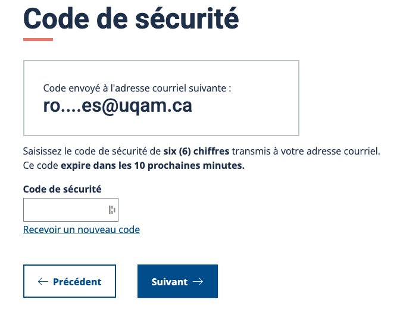
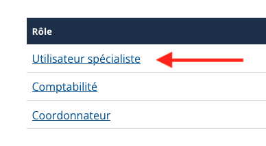
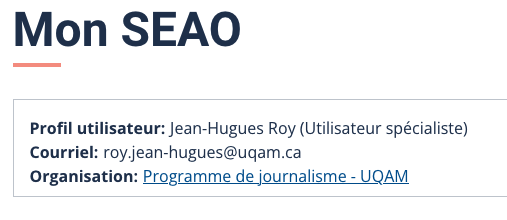

# 🧀 SEAO et lobbyistes

<figure><figcaption>
Ancien logo du SÉAO
</figcaption></figure>

## SEAO

Jetez de temps à autre un œil sur le [**Système électronique d’appel d’offres (SÉAO)**](https://seao.gouv.qc.ca/). On y fait parfois des trouvailles intéressantes sur les travaux ou les études que veulent entreprendre divers pouvoirs publics (ministères, municipalités, institutions, etc.)

S’abonner à ce site est gratuit, mais il faut passer par là pour télécharger des plans et devis pouvant receler des informations pertinentes.

<figure><figcaption></figcaption></figure>

Une fois que vous avez créé un compte, il faut se connecter à nouveau par le biais du Service d'authentification gouvernementale À CHAQUE FOIS qu'on veut utiliser le SÉAO. Je sais, c'est GOSSANT! Vous recevrez par courriel un 💀 code de sécurité...

<figure><figcaption></figcaption></figure>

### Votre rôle -> _**Utilisateur spécialiste**_

Une fois ce code entré, vous devez ensuite choisir votre rôle. Choisissez celui d'**utilisateur spécialiste**.

<figure><figcaption></figcaption></figure>

Voilà! Vous pouvez désormais faire des recherches dans le SÉAO et surtout télécharger les documents pertinents qui contiennent souvent des informations d'intérêt public (devis, plans, addendas, etc.).

Choisissez la [**RECHERCHE AVANCÉE**](https://seao.gouv.qc.ca/recherche-avancee) pour vous faciliter la vie.

<figure><figcaption></figcaption></figure>

## Achats Canada

<figure><figcaption></figcaption></figure>

Au fédéral, l’outil de recherche des appels d’offres sur les marchés publics s’appelle [**Achats Canada**](https://achatscanada.canada.ca/fr). Consultez-y les **occasions de marché**. Il couvre non seulement les agences du gouvernement fédéral, mais aussi les appels d’offres lancés par différentes provinces canadiennes. Utile si vous êtes appelé.e à travailler à l’extérieur du Québec.

## Registres des lobbyistes

<figure><figcaption></figcaption></figure>

Une autre très bonne façon de trouver de la nouvelle dans votre région ou votre secteur d’activité, c’est de consulter régulièrement [**Carrefour Lobby Québec**](https://www.carrefourlobby.quebec/home), le nouveau nom du **Registre des lobbyistes**. En faisant une recherche par municipalité ou par ministère, par exemple, vous êtes en mesure de voir pour quels projets, au juste, des entrepreneurs ou des organismes font des démarches auprès de ces organismes publics.

🇨🇦 Le [**Registre fédéral des lobbyistes**](https://lobbycanada.gc.ca/app/secure/ocl/lrs/do/guest?lang=fra) est intéressant pour les mêmes raisons. Vous pouvez même vous créer des alertes 🚨 pour être informé de la publication de nouvelles activités de lobbying qui pourraient vous intéresser.
