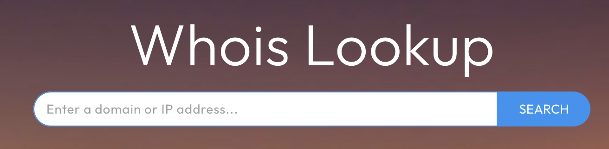

# 📚 Annuaires et whois

## Annuaires téléphoniques

Il n’existe pas de répertoire gratuit de numéros de téléphone cellulaire. Pareil outil serait pratique, car de moins en moins de gens possèdent une ligne téléphonique terrestre. [**Canada411**](https://www.fr.canada411.ca/search/address.html) demeure néanmoins utile. Jusqu’en 2014, même l’ex-maire de Laval, Gilles Vaillancourt, y était encore inscrit!

Faites-y des recherches par adresse pour trouver le numéro de téléphone qui y est associé, ou encore par code postal, pour rejoindre des voisins.

<figure><figcaption><p>Interface de Canada411</p></figcaption></figure>

## Truc Google pour trouver des numéros de cellulaire

Pour trouver le numéro de quelqu'un avec une recherche Google, combinez le nom de la personne avec les indicatifs régionaux de la région où elle habite.

### Île de Montréal

```
"Prénom Nom" 514 OR 438 OR 263
```

### Grand Montréal

```
"Prénom Nom" 450 OR 579 OR 354
```

### Capitale-Nationale et Est du Québec

```
"Prénom Nom" 418 OR 581 OR 367
```

### Estrie, Mauricie, Outaouais, Abitibi-Témiscamingue et Nord du Québec

```
"Prénom Nom" 819 OR 873 OR 468
```

***

<figure><figcaption><p>L'interface du service «whois» de Domain Tools.</p></figcaption></figure>

## _whois_

Il est possible de savoir à qui appartient un site web. Pour y arriver, il faut consulter la fiche _whois_ du site. “Who is” signifie « qui est »? Alors il s’agit de savoir qui « est » ce site, qui est derrière. Pour trouver les propriétaires d’un site web, le meilleur outil demeure [le _whois_ de **DomainTools**](https://whois.domaintools.com/). Il en existe plusieurs autres, comme [**Who.is**](http://who.is/), par exemple.


Attention de bien lire les informations sur les résultats de recherche 👇👇


Si vous ne voyez aucune coordonnée, on vous fournit peut-être des instructions (une adresse web) pour trouver les informations que vous cherchez.

<figure><figcaption><p>Lisez bien les résultats après un « whois ».</p></figcaption></figure>

L’identité des gens qui ont enregistré un nom de domaine se terminant par **.ca** est protégée et n’est pas divulguée par un simple _whois_. Il est cependant possible de l’obtenir en passant par le site de l’[**Autorité canadienne pour les enregistrements Internet (ACEI)**](https://acei.ca/noms-de-domaine-ca/whois) qui propose un formulaire d’envoi de message au ou à la propriétaire… qui vous répond seulement s’il le veut bien.

