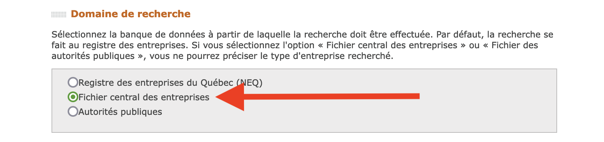
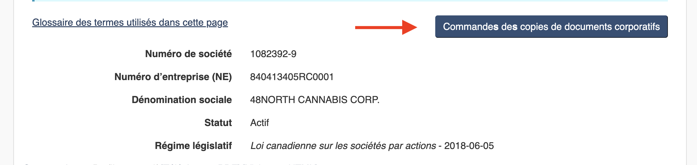

# 🏭 Registre des entreprises

Le plus utile de tous les outils de recherche offerts gratuitement par l’État québécois est sans contredit le [**Registre des entreprises (REQ**](https://www.quebec.ca/entreprises-et-travailleurs-autonomes/obtenir-renseignements-entreprise/recherche-registre-entreprises/acceder-registre-entreprises)**)**. Il permet non seulement de savoir à qui appartient une société ou qui sont les administrateurs d’un organisme sans but lucratif, mais également de connaître leur adresse personnelle. À la fois fantastique et troublant.

<figure><figcaption>
Le REQ contient, notamment, l’adresse personnelle de l’ex-chef du Parti québécois.
</figcaption></figure>

Quelques réflexes pour trouver des personnes dans le REQ:

* Pensez à toutes les **entreprises** dont elles peuvent être actionnaires ou tous les **organismes** auxquels elles peuvent être associées (associations, syndicats, chambres de commerce, partis politiques, etc.).
* Pensez aussi aux organismes sans but lucratif sur le **conseil d’administration** desquels elles peuvent siéger (organismes culturels \[orchestres, par exemple], éducatifs \[établissements scolaires], etc.).
* Pensez enfin d’essayer simplement le **nom** de ces personnes, ou celui de leur **conjoint.e**, car elles peuvent avoir créé une entreprise éponyme.

### Recherche avancée

Si vous vous faites des recherches historiques et que vous vous intéressez à une entreprise qui a été créée avant 1994, faites une recherche avancée, puis, sélectionnez le **«Fichier central des entreprises»**. Vous obtiendrez alors des renseignements un peu moins riches que ce qu'offre le REQ, mais qui pourraient tout de même s'avérer utiles.

<figure><figcaption></figcaption></figure>

### Corporations Canada

Si le REQ ne trouve pas une entreprise que vous cherchez, il se peut qu’il s’agisse plutôt d’une société de régime fédéral. C’est alors [**Corporations Canada**](https://www.ic.gc.ca/app/scr/cc/CorporationsCanada/fdrlCrpSrch.html?locale=fr\_CA) qui peut vous aider à en trouver les administrateurs.

Il est désormais possible de commander immédiatement des copies des documents corporatifs d'une société canadienne si vous avez besoin de savoir quand, au juste, une personne a commencé ou cessé d'administrer ou d'être actionnaire de cette société.

<figure><figcaption></figcaption></figure>

### OpenCorporates

<figure><figcaption></figcaption></figure>

Cependant, le REQ ainsi que Corporations Canada ne permettent que des recherches par nom d’entreprise. Depuis plusieurs années, on rêve d’un outil qui permettrait de faire des **recherches inversées**, c'est-à-dire par nom d’actionnaire ou d’administrateur.

Eh bien cet outil est apparu en 2014. Il s’agit d’[**OpenCorporates**](https://opencorporates.com/). Si vous souhaitez connaître le nom de toutes les compagnies qui appartiennent à PKP, entrez son nom et _shazam!_

C'est un site auquel il vaut la peine de s'inscrire!

Le gouvernement du Québec a cependant demandé à OpenCorporates de cesser de glaner son Registraire des entreprises pour y moissonner des données. Ce à quoi OpenCorporates a rétorqué par [une poursuite](https://www.lapresse.ca/techno/201704/06/01-5085945-quebec-poursuivi-par-la-plus-grande-banque-de-donnees-dentreprises-au-monde.php), qu’elle [a gagnée](https://www.canlii.org/fr/qc/qccs/doc/2019/2019qccs3801/2019qccs3801.html?searchUrlHash=AAAAAQAQIk9wZW5Db3Jwb3JhdGVzIgAAAAAB\&resultIndex=1). Ouf!

***

<figure><figcaption></figcaption></figure>

L'équivalent en France est [**Sirène**](http://www.sirene.fr/sirene/public/accueil), qui permet d'obtenir quelques informations sur des sociétés établies dans l'Hexagone 🇫🇷.
