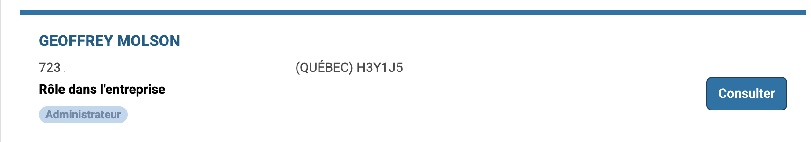
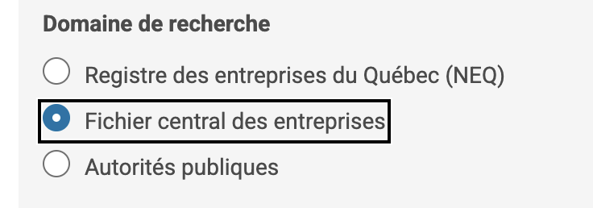
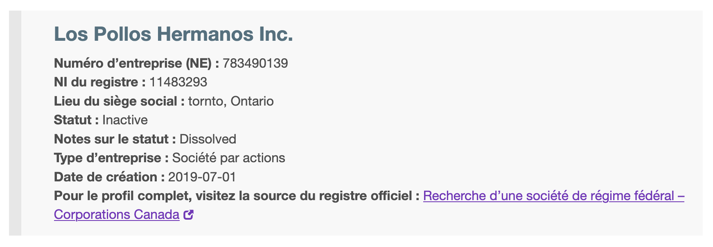
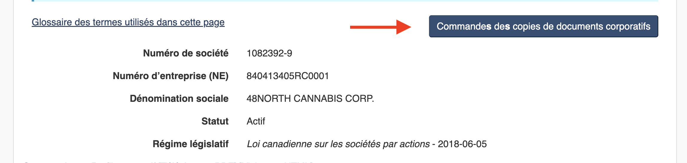
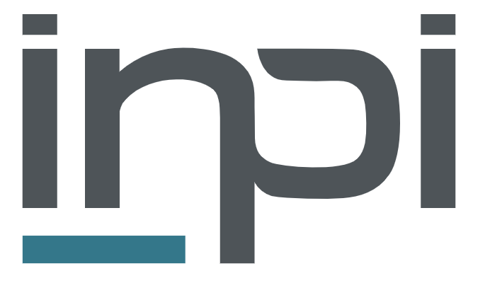

# 🏭 Registre des entreprises

Le plus utile de tous les outils de recherche offerts gratuitement par l’État québécois est sans contredit le [**Registre des entreprises (REQ**](https://www.quebec.ca/entreprises-et-travailleurs-autonomes/obtenir-renseignements-entreprise/recherche-registre-entreprises/acceder-registre-entreprises)**)**. Il permet notamment de savoir à qui appartient une société ou qui administre un organisme sans but lucratif.

Il permet également, dans bien des cas, de connaître leur adresse personnelle. À la fois fantastique et troublant.

<figure><figcaption>
Il est parfois possible de trouver les adresses personnelles de membres éminents de la société québécoise.
</figcaption></figure>

Il y a trois portes d'entrée pour faire des recherches dans le REQ.

### [Par nom d'organisation](https://www.registreentreprises.gouv.qc.ca/reqna/gr/gr03/gr03a71.rechercheregistre.mvc/gr03a71?choixdomaine=RegistreEntreprisesQuebec)

C'est le mode classique de recherche. Vous entrez le nom de l'entreprise ou de l'organisation qui vous intéresse et vous en avez les actionnaires et/ou les administrateurs.

### [Par nom d'individu](https://www.registreentreprises.gouv.qc.ca/REQNA/GR/GR03/GR03A71.RechercheRegistre.MVC/GR03A71/RechercheNomPrenom)

Nouveau mode accessible depuis juillet 2024! Il est possible de faire des recherche **par prénom et nom de famille**, ce qui facilite considérablement le travail des journalistes.

Si vous ne trouvez rien, pensez faire une recherche avec le nom des **personnes apparentées** (parents, enfants, conjoints) aux personnes qui vous intéressent.

### Recherche de plus vieilles entreprises

Si vous vous faites des recherches historiques et que vous vous intéressez à une entreprise qui a été créée avant 1994, faites une recherche avancée, puis, sélectionnez le **«Fichier central des entreprises»**. Vous obtiendrez alors des renseignements un peu moins riches que ce qu'offre le REQ, mais qui pourraient tout de même s'avérer utiles.

<figure><figcaption></figcaption></figure>

Au besoin, pour les cas où vous faites une longue enquête ou un documentaire, il est possible de demander des copies des [documents originaux](https://www.quebec.ca/entreprises-et-travailleurs-autonomes/obtenir-renseignements-entreprise/copie-document-certificat-registraire-entreprises) d'une entreprise qui contiennent parfois des renseignements intéressants.

***

### Registres canadiens des entreprises 🇨🇦

Si le REQ ne trouve pas une entreprise que vous cherchez, il se peut qu’il s’agisse plutôt d’une société de régime fédéral ou qu'elle soit enregistrée dans une autre province.

<figure><figcaption>
De petits rigolos ont enregistré cette entreprise en Ontario en 2019.
</figcaption></figure>

Innovation, Sciences et Développement économique Canada a créé un [**outil de recherche pancanadien**](https://ised-isde.canada.ca/cbr-rec/fr/chercher)! Il fouine dans les registres des entreprises de sept provinces canadiennes ainsi que dans le registre fédéral:

* [Colombie-Britannique](https://www.bcregistry.gov.bc.ca/en-CA) (Business Registry)
* [Alberta](https://www.servicealberta.gov.ab.ca/consumer/business_search/) (Business Registry)
* [Saskatchewan](https://www.saskregistries.ca/corporateregistry) (Corporate Registry)
* [Manitoba](https://companiesoffice.gov.mb.ca/) (Companies Office)
* [Ontario](https://www.ontario.ca/fr/page/registre-des-entreprises-de-lontario) (Registre des entreprises; payant **(\$$)**)
* [Québec](https://www.quebec.ca/entreprises-et-travailleurs-autonomes/obtenir-renseignements-entreprise/recherche-registre-entreprises/acceder-registre-entreprises) (Registre des entreprises)
* [Nouvelle-Écosse](https://beta.novascotia.ca/fr/recherche-de-renseignements-deposes-aupres-du-registre-des-societes-de-capitaux-concernant-une-entreprise-ou-un-organisme-non-lucratif) (Registre des sociétés)

Il est également possible de commander immédiatement des copies des documents corporatifs d'une société canadienne si vous avez besoin de savoir quand, au juste, une personne a commencé ou cessé d'administrer ou d'être actionnaire de cette société.

<figure><figcaption></figcaption></figure>

### Registre des particuliers ayant un contrôle important (PCI)

Depuis 2024, le gouvernement fédéral impose aux sociétés de régime fédéral de tenir un registre des [particuliers ayant un contrôle important](https://ised-isde.canada.ca/site/corporations-canada/fr/renseignements-particuliers-ayant-controle-important-seront-mis-disposition-public). Ces informations seront bientôt mises à la disposition du public (et de vous, journalistes). À suivre!

***

### Registres d'autres pays 🌍

La page Wikipedia des registres des entreprises dans le monde (en [anglais](https://en.wikipedia.org/wiki/List_of_official_business_registers)) peut vous être utile si vous vous intéressez à des sociétés basées ailleurs.

En France, l[**'INPI**](https://data.inpi.fr) vous permet d'obtenir des informations sommaires sur des sociétés établies dans l'Hexagone 🇫🇷, mais aussi sur des marques et des brevets (via Olivier Picard).

<figure><figcaption></figcaption></figure>

### OpenCorporates&#x20;

OpenCorporates était utile pour faire des **recherches inversées**, c'est-à-dire par nom d’actionnaire ou d’administrateur. Mais il est moins nécessaire d'y recourir depuis que cette option est disponible dans le REQ.

<figure><figcaption></figcaption></figure>
